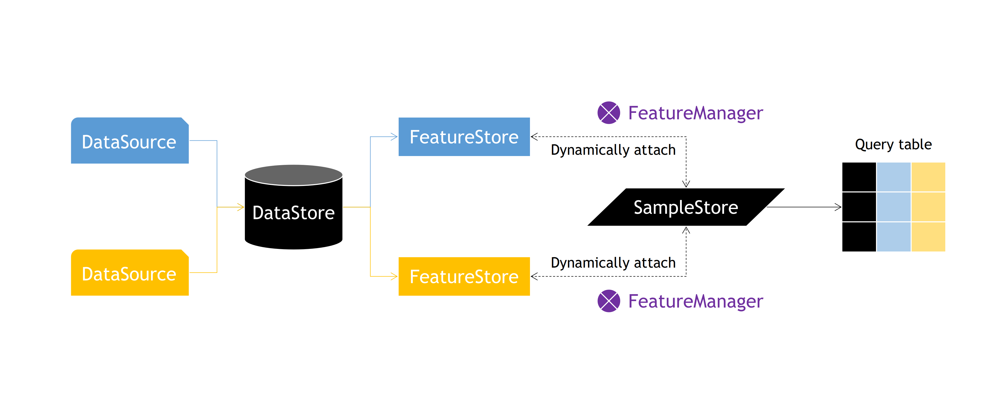

# Octobus

A python module for bioinformatics to organize, manage, and access omics datasets, 
serving as data portal for modeling. Mainly contains 5 concepts below:

* __DataSource__: Collect different types of data, and unify with formatted entities and 
features.Only support for `pandas.DataFrame` temporally.

* __DataStore__: Register and inject multiple data sources to a store, which follow-up 
steps taking from.

* __FeatureStore__: Extract and slicing particular data source from `DataStore`.

* __SampleStore__: Target samples, bind `FeatureStore` with `FeatureContext` 
in a _first-in-last-out_ manner (extend to version control in future), and support 
for sample filtering.

* __FeatureManager__: _Dynamically_ attach `FeatureStore` to `SampleStore`, flexibly 
implementing the functionality of cross-table querying.



## Getting Started

Now start working with __octobus__. 

### Installing

Python __3.7+__ are required. Try this command if [pip](https://pip.pypa.io/en/stable/installing/) 
already in your environment.

```
pip install octobus
```

Developers can set up by cloning the repo locally.

```
git clone git@github.com:haokui/octobus.git
cd octobus
python setup.py install
```

### Usage

Quick start octobus with a simple example of accessing tables resulted from 16S sequencing,
including a genus table and a metadata table.

1. Load flat files as `pandas.DataFrame` format
    
    ```python
    import os
    from examples.utils import load_tab
    
    folder = 'examples/data'
    meta = load_tab(os.path.join(folder, 'metadata.tsv'), key='SampleID')
    genus = load_tab(os.path.join(folder, 'genus.tsv'), key='SampleID')
    
    print('Metadata shape: {}'.format(meta.shape))
    # Metadata shape: (500, 4)
    print('Genus table shape: {}'.format(genus.shape))
    # Genus table shape: (500, 134)
    ```

2. Ingest data to `DataStore`

    ```python
    from octobus import DataStore
      
    data_store = DataStore()
    data_store.ingest(name='meta', dataframe=meta)
    data_store.ingest(name='genus', dataframe=genus)
    # ---------------------
    # ingested data source name: meta
    # ingested features: 4
    # ingested entities: 500
    # ingested data source name: genus
    # ingested features: 134
    # ingested entities: 500
    # ---------------------
 
    print('Entities of genus in data store: {}'.format(len(data_store['genus'].entities)))
    # Entities of genus in data store: 500
    print('Features of genus in data store: {}'.format(len(data_store['genus'].features)))
    # Features of genus in data store: 134
    ```

3. Extract and slice data to `FeatureStore`
    ```python
    from octobus import FeatureStore
    
    meta_store = FeatureStore(data_store['meta'], name='meta')
    genus_store = FeatureStore(data_store['genus'], 
                               features=data_store['genus'].features[:50], 
                               name='genus')
 
    print('Entities of meta store: {}'.format(len(meta_store.entities)))
    # Entities of meta store: 500
    print('Entities of genus store: {}'.format(len(genus_store.entities)))
    # Entities of genus store: 500
    print('Features of genus store: {}'.format(len(genus_store.features)))
    # Features of genus store: 50
    ```

4. Register `SampleStore`

    ```python
    samples = SampleStore(samples=meta_store.entities)
    ```

    1. Dynamically attach `FeatureStore` with `FeatureManager`
    
    2. Filter samples
    
    3. Pack data
    
    ```python
    from octobus import DataSet, FeatureManager
    
    # 1. Dynamically attach FeatureStore to SampleStore
    with FeatureManager(meta_store, samples) as fm_meta:
        with FeatureManager(genus_store, samples) as fm_genus:
           
            # 2. Filter samples
            samples.filter(samples['Age'] < 60)
         
            # 3. Pack resulted data
            data_set = DataSet(X=samples.get_data(features=genus_store.features),
                               y=samples.get_data(features=['Antibiotics Usage']))
            
            print('data set: \n{}'.format(data_set.get_data()))
            print('X in data set: \n{}'.format(data_set.X))
            print('y in data set" \n{}'.format(data_set.y))
    
        # <<< 50 features are removed with genus [feature store]
        print('features out of genus context: {}'.format(samples.feature_context.features))
        # features out of genus context: ['Age', 'Body Mass Index', 'Gender', 'Antibiotics Usage']
         
    # <<< 4 features are removed with meta [feature store]
    print('features out of meta context: {}'.format(samples.feature_context.features))
    # features out of meta context: []
    ```

## Contributing

__PRs are always welcomed__ :heart: 

1. Fork the Project
2. Create your Feature Branch (`git checkout -b feature/AmazingFeature`)
3. Commit your Changes (`git commit -m 'Add some AmazingFeature'`)
4. Push to the Branch (`git push origin feature/AmazingFeature`)
5. Open a Pull Request

For feature requests or bug reports, post it on [Issue](https://github.com/haokui/octobus/issues).
If you have any question or suggestions, contact us with email: [haokui.zhou@gmail.com](haokui.zhou@gmail.com)

## License

This project is licensed under the BSD 3-Clause License - see the [LICENSE](LICENSE.txt) file for details
